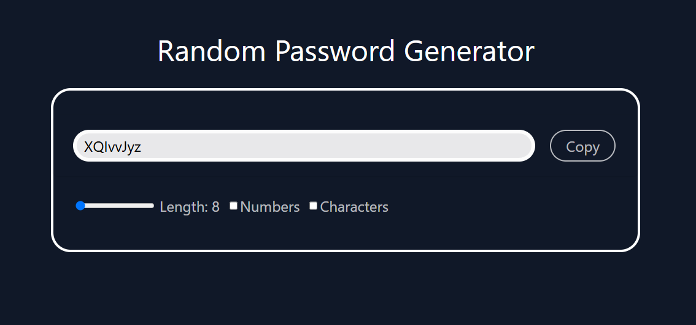

# 🔐 Random Password Generator

A modern and responsive **Random Password Generator** built with **React + Vite** and styled using **Tailwind CSS**.

This app allows users to:

- Generate secure random passwords in a specified **length range (8–20 characters)**.
- Optionally include **numbers** and **special characters**.
- Copy the generated password to the clipboard with a single click.

---

## 🚀 Features

✅ Adjustable password length  
✅ Toggle inclusion of:

- Numbers (e.g., 0–9)
- Special characters (e.g., !@#$%^&\*)  
  ✅ One-click **Copy to Clipboard**  
  ✅ Fully responsive design  
  ✅ Built with **React + Tailwind CSS** using Vite for fast development

---

## 🖼️ Screenshot

> Add a screenshot of your app UI here:  
> Save your screenshot as `screenshot.png` in the root folder and it will show up below.



---

## ⚙️ Tech Stack

- **React** (via Vite scaffold)
- **Vite** (for lightning-fast builds)
- **Tailwind CSS** (for styling)
- **JavaScript (ES6+)**

---

## 📦 Installation

```bash
# Clone the repo
git clone https://github.com/your-username/random-password-generator.git

# Navigate into the project directory
cd random-password-generator

# Install dependencies
npm install

# Start the development server
npm run dev
```
